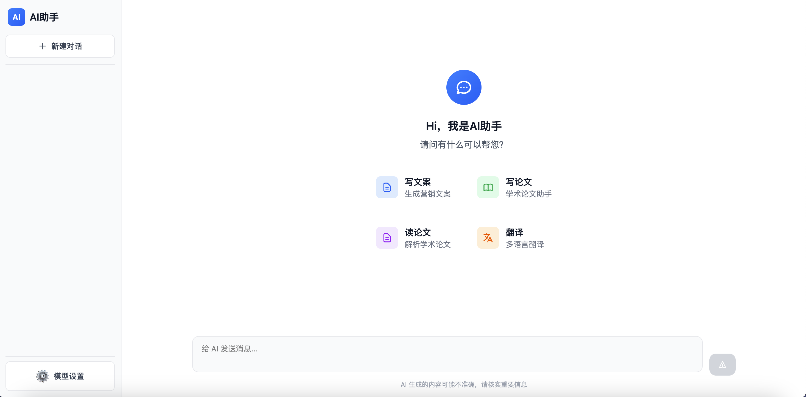
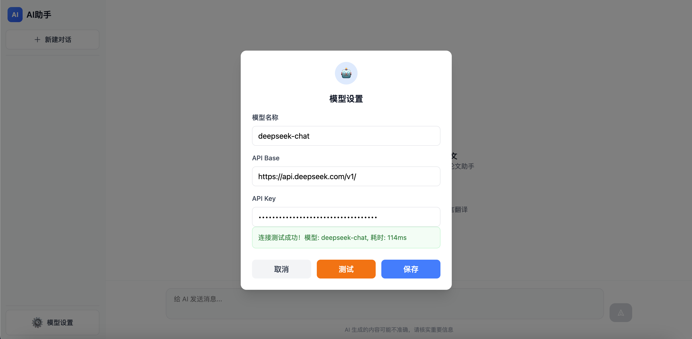
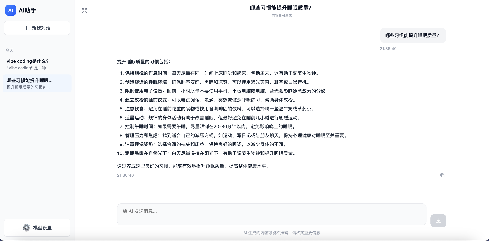

# AI聊天助手

一个使用 React + TypeScript 构建的现代化AI聊天应用，支持会话管理、自由配置模型、智能对话和Markdown渲染。

## 🚀 快速开始

### 环境要求

- Node.js 18+
- npm 或 yarn

### 安装步骤

1. **克隆项目**
   ```bash
   git clone https://github.com/zhangzg1/ai_robot.git
   cd ai_robot
   ```

2. **安装依赖**
   ```bash
   npm install
   ```

3. **启动开发服务器**
   ```bash
   npm run dev
   ```

4. **打开浏览器**
   访问 `http://localhost:5173` 查看应用

## 📦 可用脚本

- `npm run dev` - 启动开发服务器
- `npm run build` - 构建生产版本
- `npm run preview` - 预览生产版本

## 🖼️ 效果展示

### 主界面


### 模型设置


### 聊天对话与会话管理


## 🛠 技术栈

- **前端框架**: React 19
- **类型系统**: TypeScript
- **构建工具**: Vite
- **样式框架**: Tailwind CSS
- **Markdown渲染**: react-markdown
- **代码高亮**: react-syntax-highlighter
- **数据存储**: LocalStorage
- **包管理器**: npm

## 📁 项目结构

```
src/
├── components/             # React组件
│   └── ChatInterface.tsx   # 聊天界面主组件
├── assets/                 # 静态资源
│   └── react.svg           # React图标
├── api.ts                  # AI API封装
├── types.ts                # 消息类型定义
├── App.tsx                 # 主应用组件
├── index.css               # 全局样式
└── main.tsx                # 应用入口

images/                     # 页面展示图片
├── main-interface.png      # 主界面展示
├── chat-demo.png           # 聊天对话演示
├── settings-dialog.png    # 模型设置对话框
└── conversation-management.png # 会话管理功能
```

## 🎨 功能特性

- ✅ **会话管理**: 支持多个会话，用户自由切换不同的历史对话
- ✅ **模型配置**: 用户可自由配置任何AI模型，并支持模型测试
- ✅ **流式输出**: AI回答逐字显示，提供实时对话体验
- ✅ **多轮对话**: 支持上下文记忆，AI能理解历史对话内容
- ✅ **Markdown支持**: 完整支持Markdown格式，包括代码块和语法高亮
- ✅ **本地存储**: 对话历史和会话自动保存，刷新页面不丢失
- ✅ **智能交互**: 发送时自动禁用输入框，防止重复提交
- ✅ **错误处理**: 友好的错误提示和加载状态显示

## 📄 许可证

MIT License
